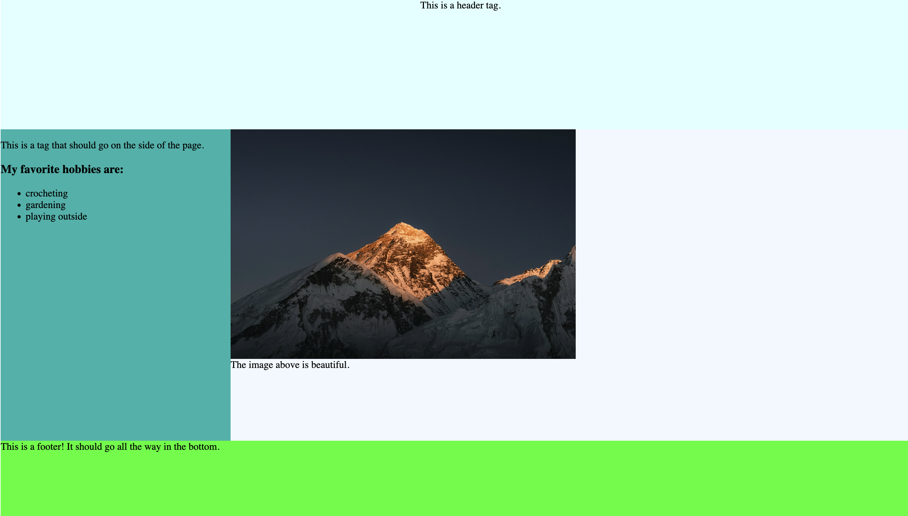

# Responsive-units-final

### Learning Goal being tested: 
- 7.0: **Level 3** Responsive Units 
- 7.1: **Level 3** Flex Properties

## Instructions: 
Add the width and height to the following tags and classes so it matches the wireframe below: 

为以下标签和类添加宽度与高度，使其与下方的线框图相匹配：

- header
- .middle-section
- aside
- .image-section
- footer

Add flex properties to the following classes so it matches the wireframe given: 

为以下类添加 Flex 属性，使其与给定的线框图相匹配：

- .middle-section
- .image-section

### Wireframe below: 
